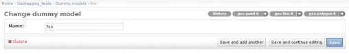
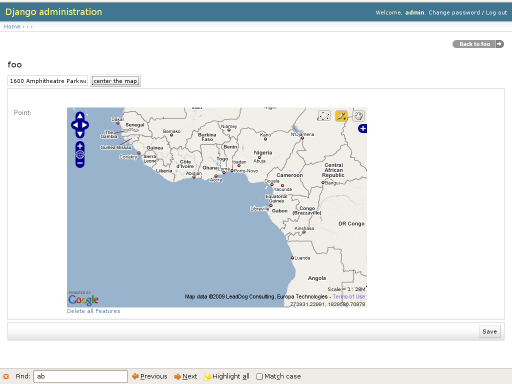
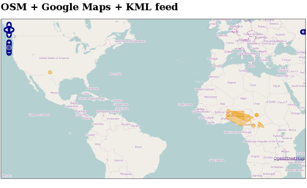
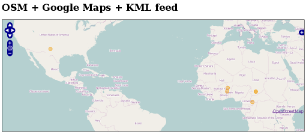
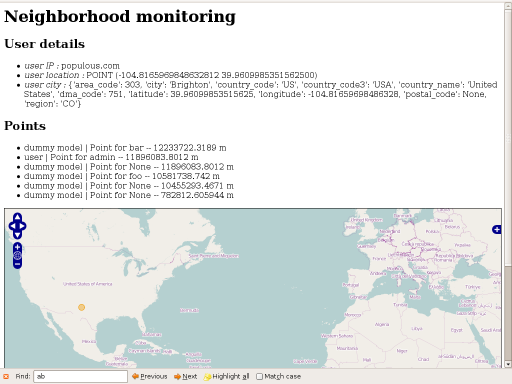

--------
Tutorial
--------

.. contents::

After reading this page you should be able to use `geotags` in the context of
your project. For practical reason I will use `geotagging_demo_project`  as
example. The installation of this project is explained in the documentation
`INSTALL.rst`.

Geotag contents
---------------

`geotags` comes with an handy customization of the django `admin site`, it allows you to
add edit your geotags directly with in the admin interface.

When you edit any object with in the django database you will see 3 buttons in
the top right corner. They allow you to associate a Point, a Line, a Polygon to it:

.. Note:: The geocoder will work only if you use django-grappelli_. It requires jQuery.

.. _django-grappelli: http://code.google.com/p/django-grappelli/

Point
=====

You will find below a screen shot of the interface to add or edit a point. The
intarface for adding a line or a polygon is very similar :

KML feeds and maps
------------------

`geotags` comes with 2 ways to consume the geometries you have associated to your
django objects::

* maps
* kml feeds

You have 3 types of URL patterns to select what you want to see :

points, lines and polygons
  URL : http://127.0.0.1:8000/geotagging/kml_feeds_map/all/

points or lines or polygons
  URL : http://127.0.0.1:8000/geotagging/kml_feed_map/point/

.. Note:: You can replace point by line or polygon

points or lines or polygons for a particular content type
  URL : "http://127.0.0.1:8000/geotagging/kml_feed_map/point/dummy model/"
  You can add the name of the content type you want to work on.

Neighborhood monitoring
-----------------------
`geotags` comes also with the capability to present to your user the objects
that have been geotags in their neighborhood.

* URL : http://127.0.0.1:8000/geotagging/neighborhood_monitoring/10/

The last bit in the url, the integer, represents the radius in km around him.
The user location is determined using geoip from maxmind_. It is based on the
user's IP address.

.. _maxmind: http://www.maxmind.com/
